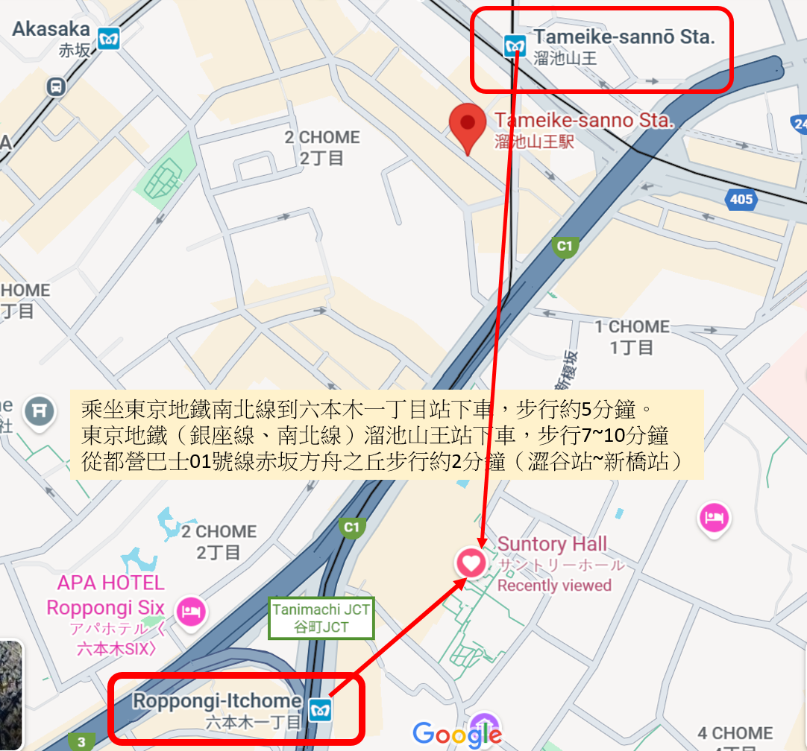

# Travel_JAPAN
- [東京](./東京/readme.md)
# DISC UNION
- https://diskunion.net/
- 店舗情報|店舗一覧 ==> https://diskunion.net/st/shop/area/
- [大阪クラシック館](https://diskunion.net/shop/ct/osaka_classic)
- 新宿地區
  - [Disk Union Shinjuku Classical Music CD Record Store](https://diskunion.net/shop/ct/shinjuku_classic)
    - 東京都新宿区新宿3-17-5 T&TIIIビル 3F
    - 位置便利 距離【新宿站】和【新宿三丁目站】步行5分鐘
- [お茶の水クラシック館](https://diskunion.net/shop/ct/ocha_classic)
  - 2025.8.8 買到Bernstein Mahler 3 Holland版 
# Recordcity
- RECORD CITY SHOP
- 〒160-0023 东京都新宿区西新宿7-8-3-202
- Opening 13:00-20:00 年中無休（年末年始を除く）
- e-mail: shop@recordcity.jp1
- Only some of the items listed on the web site are sold in the store.
# 日本音樂廳
- https://zh.wikipedia.org/zh-tw/Category:%E6%97%A5%E6%9C%AC%E9%9F%B3%E6%A8%82%E5%BB%B3
- 三得利音樂廳（日語：サントリーホール，Suntory Hall）
  - 位於日本東京方舟之丘的音樂廳。
  - 這座音樂廳開業於1986年10月12日，由森大廈所有，三得利屬下的基金會三得利藝術財團營運。
  - 三得利音樂廳是東京首座古典音樂專用設計音樂廳，但也可以用來舉辦其他音樂類型的演奏會。
  - 由於其傑出的聲學設計，被評價為世界百大廳院之一。
  - 東京都港區赤坂1-13-1
  - [Google 地圖](https://www.google.com/maps?cid=3914990970027065298)
  - 乘坐東京地鐵南北線到【六本木一丁目站】下車，3號出口步行約5分鐘。
  - 東京地鐵（銀座線、南北線）【溜池山王站】下車，步行7~10分鐘
  - 從都營巴士01號線赤坂方舟之丘步行約2分鐘（澀谷站~新橋站）
  - https://www.suntory.com/culture-sports/suntoryhall/
  - https://www.gltjp.com/zh-hant/directory/item/13903/

