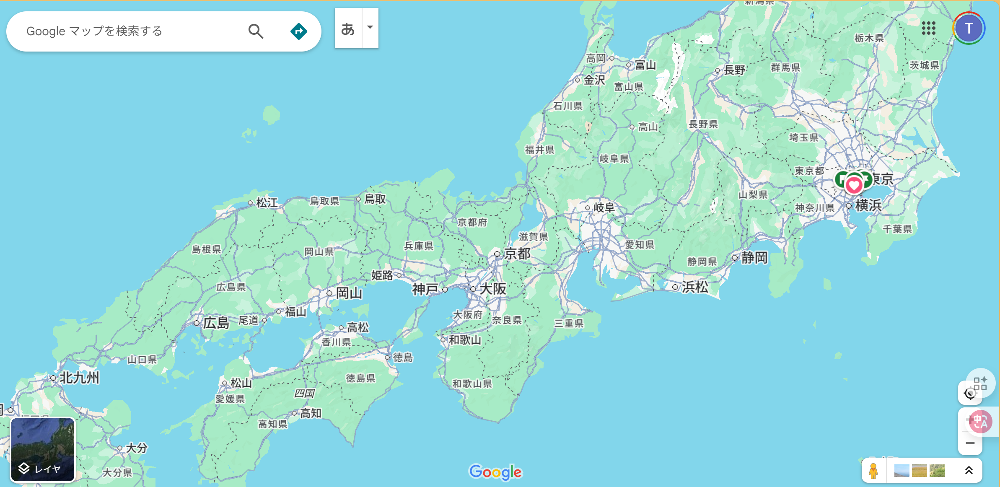
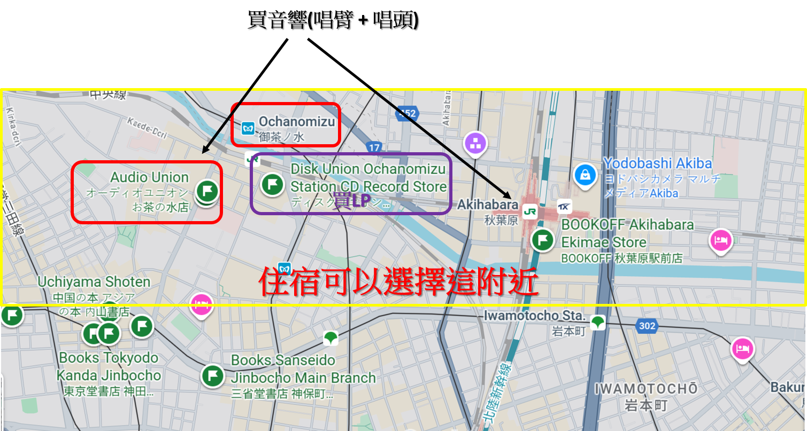
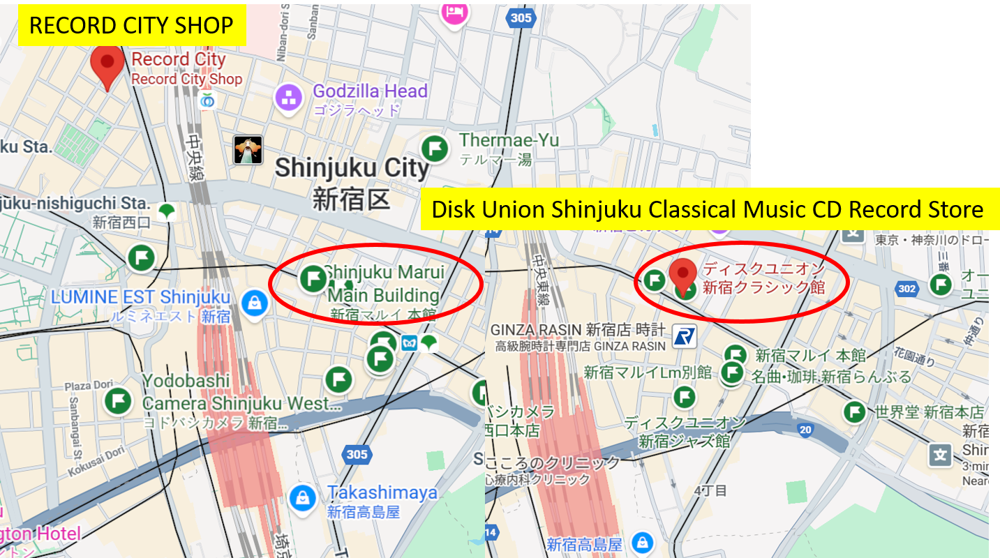
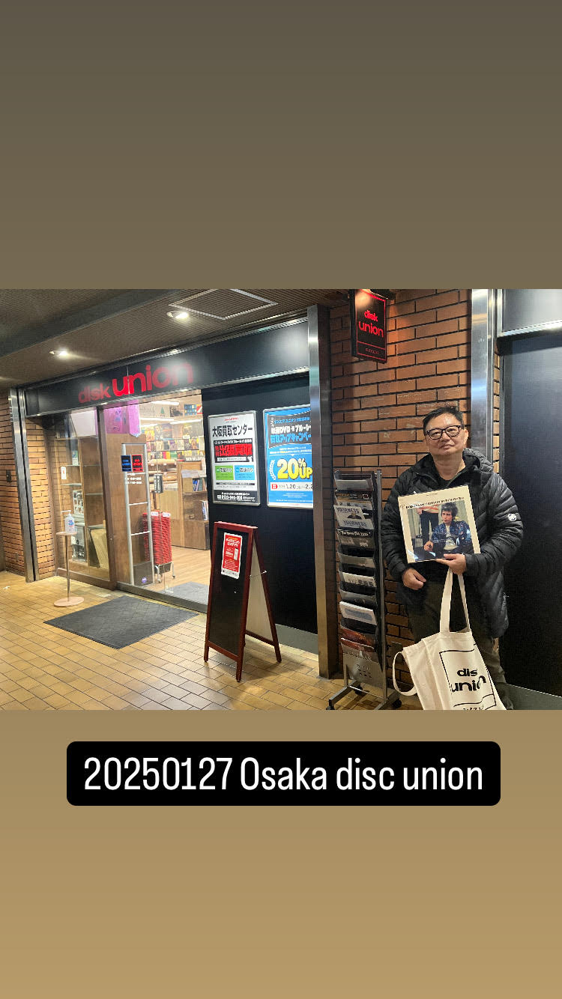

# Travel_JAPAN
- [東京](./東京/readme.md)
- [東京旅遊官方網站GO TOKYO](https://www.gotokyo.org/tc/index.html)

## 音響 ==? 秋葉原 買唱臂 唱針

- https://akihabara-bc.jp/akihabara-audio-equipment-stores/
- https://today.line.me/tw/v3/article/5LWMvy
- hi-fido
  - 距離末廣町站步行約2分鐘的二手音響店
  - 他們不僅購買和銷售二手音響，還購買和銷售零件。
  - 與其他商店相比，由於都是舊產品，價格較高，但有很多產品經過維護，幾乎所有產品（配件等除外）都享有自購買起一年的保固。
  - 〒101-0021 東京都千代田區外神田5-3-12 清和大廈   營業時間：11：00~20：00  電話：03-5818-4751 
- Hard off (book off旗下)
  - Hard Off 秋葉原店
  - Hard Off 秋葉原1號店  〒101-0021 千代田區外神田3-11-2  營業時間：11：00~20：00  電話：03-6206-4861
  - Hard Off 秋葉原2號店  〒101-0021 東京都千代田區外神田3-8-1 YS大廈  營業時間：11：00~20：00  電話：03-6260-9267 
- 東京・秋葉原「テレオン 第2店 sound 110」
  - Sound110 (秋葉原，萬世橋往昌平橋之間，限日語)
  - https://online.stereosound.co.jp/_ct/17179059
- 《日本最大音響店DYNAMIC AUDIO 5555》
- Dynamic Audio的二家店（秋葉原四家，新宿二家），一家是賣二手的
  - Dynamic Audio Trade Center，位於神田明神通旁的音響專賣店。 
  - https://www.dynamicaudio.jp/
  - https://dynamicaudio4f.wordpress.com/2025/08/09/summer-analog-fair-in-h-a-l-3/
- Dynamic Audio 5555 - 庫存豐富的老字號店
  - 另一家在對街，稱為Dynamic 5555，共有七層，每一層所賣的等級都不一樣
  - https://dynamicaudio4f.wordpress.com/
  - https://astia.pixnet.net/blog/post/49678314
  - 從秋葉原站電器街口步行約5分鐘，沿著神田明神通。
  - 從1樓到7樓，從簡單的物品到高級的音響設備，他們都應有盡有，每層樓都有專業的工作人員駐守。 還有各種音響設備的展覽和可以聆聽的角落。
  - 〒101-0021 東京都 千代田區外神田3-1-18 營業時間：11：00~19：00  電話：03-3253-5555
- Yodobashi Camera Multimedia Akiba - 日本最大  ==> 四樓 大部分是音響銷售樓層
- RECORDING PROSHOP MIYAJI - 錄音設備專業
- Teleon 3rd 店 - 也提供二手商品、以舊換新和購買服務。
  - 從秋葉原站的電氣街出口步行約4分鐘，穿過萬世橋，沿著柳原通走，就是「Teleon三號店」 
- Teleon 2nd Sound 110 - 適合高端發燒友
  - 從秋葉原站電氣街口步行約3分鐘，沿著國道17號線行駛的「Teleon No.2 Sound 110」是一家老字號音響專賣店。 1樓至4樓
  - 各有中產階級到高端愛好者的音響設備，2樓也販售一些二手物品。
  - 5樓設有專用試聽室，各種產品試鏡活動僅限預約。
  - 〒101-0021 東京都千代田區外神田1-3-11 營業時間：11：00~19：00  電話：03-3251-5535
- Tomoka Electric Pro Shop - 廣播和視頻相關產品
- TOMOKA Electric Radio 百貨公司 - Yamaha 代理商
- FAL - 以平板揚聲器聞名的國內音響專賣店
- Audio Mijinko  〒101-0022 東京都 千代田區神田13-1 營業時間：11：00~20：00  休息日：週三  電話：03-6284-2927
- Soundbase」的音響專賣店 ==>它還經營稀有產品，例如澳洲 Melody 的設備和美國前製造商 Western Electric 的設備。
  - 〒101-0023 千代田區神田市松永町17-12  營業時間：11：00~19：00  電話：03-3253-5961

## 風情萬種的「禦茶之水」──東西方文化交會的街道
- https://tokyo.letsgojp.cn/archives/290050/
- 車站前更有日本最大的樂器街，神保町舊書街也在步行可及範圍內，為禦茶之水更增添了文化氣息
- JR禦茶之水站前方的「明大通」，就是日本最大的樂器街
- disk union御茶之水站前店
  - 在車站聖橋口一出來的地方有一間「disk union」，是日本有名的連鎖中古唱片行，每間分館有不同音樂類型，御茶之水站前店是所有分店中最大的，有許多早期出版的二手CD和已經絕版的黑膠唱片，而且保存狀況十分良好，是樂迷們絕對要來朝聖的地方。
  -  位址：東京都千代田區神田駿河台4-3 新お茶の水ビル2F
  -  上班時間：11：00~21：00（周日及國定假日11：00~20：00）
  -  交通方式：自JR御茶之水聖橋口徒步0分。
  -  https://thomaswo620512.pixnet.net/blog/post/46529829
- Audio Union 御茶之水店
  - https://www.audiounion.jp/
  - http://www.jpyoo.com/banzong/detail/?ArticleId=126&typeId=1
  - IKEDA Sound Labs. IKEDA9mono  https://www.audiounion.jp/ct/detail/used/217775/   ¥178,000 (税込)
  - audio-technica AT-LT13   https://www.audiounion.jp/ct/detail/used/217836/    ¥5,400 (税込)
  - ortofon LH-2000  https://www.audiounion.jp/ct/detail/used/219837/    ¥3,900 (税込)
  - audio union 御茶水店  http://www.jpyoo.com/banzong/detail/?ArticleId=126&typeId=1
  - 地址/東京都千代田區神田駿河台2-2-1   電話/03-3294-6766
  - 營業/11：00~20：00 （周日、公休日~19：00）
  - HP  ／http://www.audiounion.jp/shop/ochanomizu.html
  - 交通/JR御茶水站下車. 出禦茶水橋口，向左步行3分鐘。

# 東京買LP

### DISC UNION
- https://diskunion.net/
- 店舗情報|店舗一覧 ==> https://diskunion.net/st/shop/area/
- [お茶の水クラシック館](https://diskunion.net/shop/ct/ocha_classic)
  - 8.8 Bernstein Mahler 3 Holland版 
- 新宿地區
  - [Disk Union Shinjuku Classical Music CD Record Store](https://diskunion.net/shop/ct/shinjuku_classic)
    - 東京都新宿区新宿3-17-5 T&TIIIビル 3F
    - 位置便利 距離【新宿站】和【新宿三丁目站】步行5分鐘
### RECORD CITY SHOP
- 〒160-0023 东京都新宿区西新宿7-8-3-202
- Opening 13:00-20:00 年中無休（年末年始を除く）
- e-mail: shop@recordcity.jp1
- Only some of the items listed on the web site are sold in the store.

### [大阪クラシック館](https://diskunion.net/shop/ct/osaka_classic)

# 日本音樂廳
- https://zh.wikipedia.org/zh-tw/Category:%E6%97%A5%E6%9C%AC%E9%9F%B3%E6%A8%82%E5%BB%B3
- 三得利音樂廳（日語：サントリーホール，Suntory Hall）
  - 位於日本東京方舟之丘的音樂廳。
  - 這座音樂廳開業於1986年10月12日，由森大廈所有，三得利屬下的基金會三得利藝術財團營運。
  - 三得利音樂廳是東京首座古典音樂專用設計音樂廳，但也可以用來舉辦其他音樂類型的演奏會。
  - 由於其傑出的聲學設計，被評價為世界百大廳院之一。
  - 東京都港區赤坂1-13-1
  - [Google 地圖](https://www.google.com/maps?cid=3914990970027065298)
  - 乘坐東京地鐵南北線到【六本木一丁目站】下車，3號出口步行約5分鐘。
  - 東京地鐵（銀座線、南北線）【溜池山王站】下車，步行7~10分鐘
  - 從都營巴士01號線赤坂方舟之丘步行約2分鐘（澀谷站~新橋站）
  - https://www.suntory.com/culture-sports/suntoryhall/
  - https://www.gltjp.com/zh-hant/directory/item/13903/

