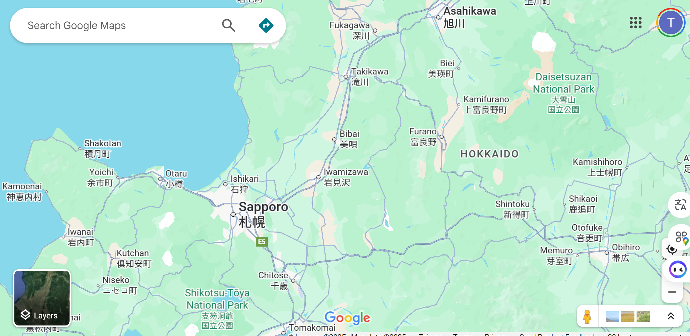
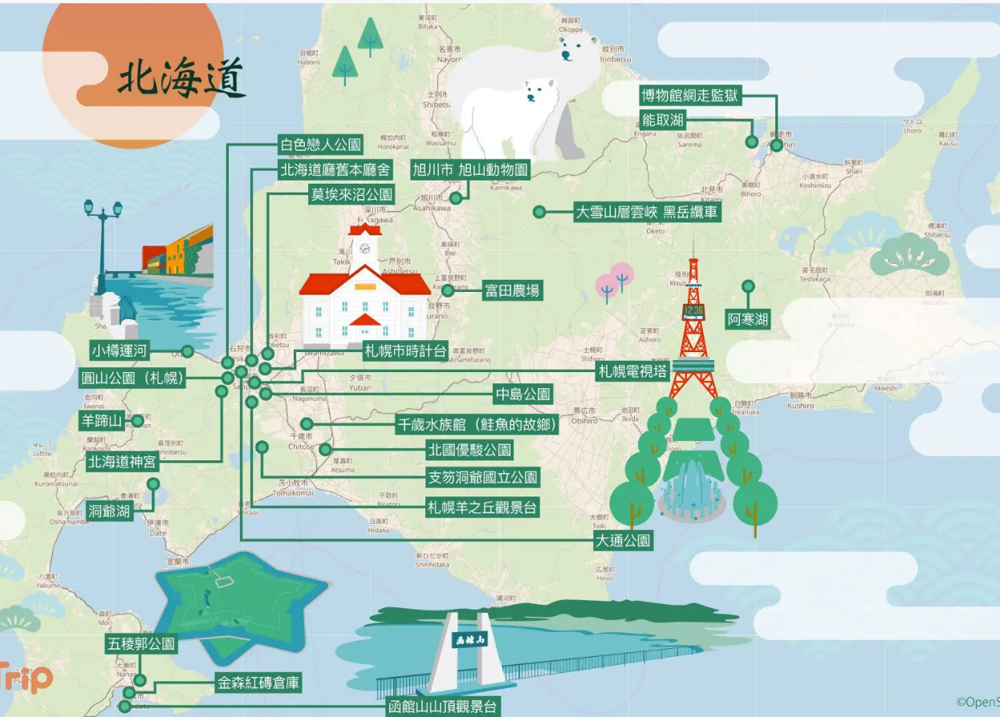
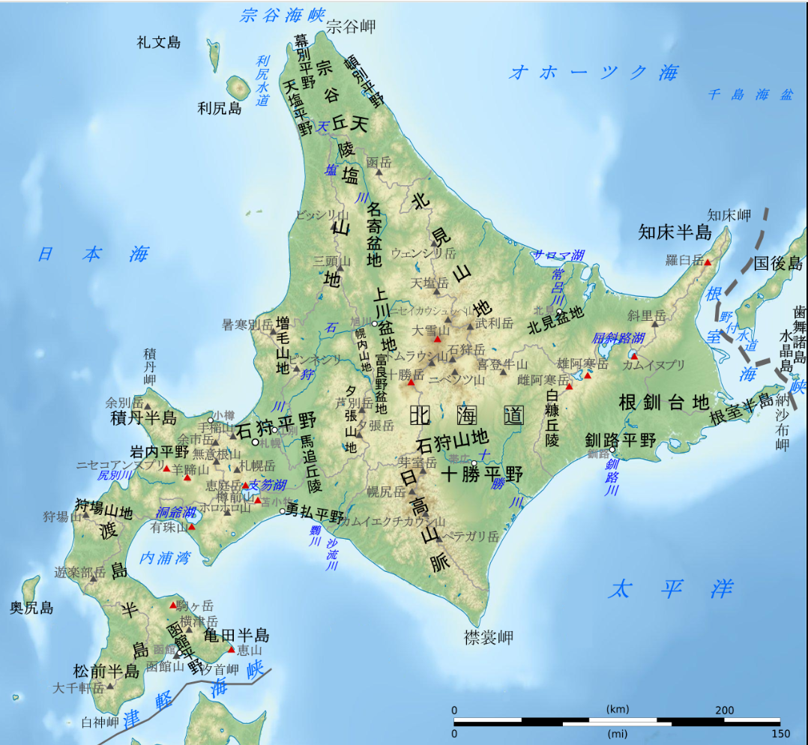

# 北海道
- 北海道位於日本的北部，南部隔津輕海峽和本州相望，北面則隔宗谷海峽和庫頁島（亦稱薩哈林島，日文稱樺太）相對，西面是日本海，東面則是鄂霍次克海、千島群島和太平洋。
- [【超嚴選】一篇搞定！北海道必買伴手禮19選](https://www.gltjp.com/zh-hant/article/item/20589/)
- [【超嚴選】北海道最好逛的16個購物景點一篇掌握！](https://www.gltjp.com/zh-hant/article/item/20775/)
- [【依類別嚴選】一篇搞定！北海道海鮮美食必吃人氣餐廳12選](https://www.gltjp.com/zh-hant/article/item/21039/)
- [【出發前必讀】北海道自由行完整指南](https://www.gltjp.com/zh-hant/article/item/20753/)

## [KKDAY](https://www.kkday.com/zh-tw/category/jp-tokyo/sightseeing-tours/list/?currency=TWD&sort=prec&page=1&count=10)
- [【北海道自駕遊完整指南】北海道租車必看重點&經典自駕行程一篇掌握！](https://www.gltjp.com/zh-hant/article/item/20974/)

#### [北海道自由行三天二夜經典行程](https://www.gltjp.com/zh-hant/article/item/20753/#zh-10-271)

## 北海道的熱門觀光行程
- https://www.kkday.com/zh-tw/category/jp-hokkaido/sightseeing-tours/list
- https://www.gltjp.com/zh-hant/summary/area/hokkaido/
- [【超嚴選】一篇就夠！北海道必看絕景景點18選](https://www.gltjp.com/zh-hant/article/item/20596/)

## 夏日北海道
- [夏日北海道](https://www.gltjp.com/zh-hant/article/item/21058/)
  - 【千歲市】支笏湖國立公園
  - 鮮豔奪目的藍色湖水聞名的「白金青池」，是美瑛町最具代表性的觀光景點之一。
  - 【積丹郡】神威岬
  - 【斜里郡】神之子池
  - 【小樽】青之洞窟
  - 夏季北海道必嚐！人氣餐廳3選
    - 【小樽市】和牛黑澤 堺町通店
      - 位於JR小樽車站步行約1分鐘的「小樽三角市場」內的著名餐廳。由同市場內的「武田鮮魚店」所經營，提供價格實惠的小樽特色新鮮海鮮料理。招牌菜包括奢華盛上小樽名產生海膽與鮭魚卵的「生海膽鮭魚卵丼」，將生海膽、螃蟹、干貝組合的「三色丼」（三食丼），以及鮭魚與鮭魚卵搭配的「親子丼」等共計25種以上的海鮮丼飯選擇。
    - 【函館市】活魚料理 魷魚清 大門店  ==> 函館市是日本著名的魷魚產地，供貨的入舟漁港更設有專門的魷魚拍賣場。
    - 北海道夏季有哪些當令的特色食材？ ==> 成吉思汗烤羊肉、蝦夷馬糞海膽、玉米、夕張哈密瓜等，都是北海道夏季盛產的特色食材，是夏季前往北海道的必嚐美味。
- [北海道五大絕景一日遊｜青池・白鬚瀑布・四季彩之丘・深山峠・Flower Land｜札幌出發](https://www.kkday.com/zh-tw/product/527901)
- [【日本北海道富良野一日遊】雲霄飛車之路・四季彩之丘・美瑛青池・白須瀑布・富田農場｜贈冰淇淋・4人成團・中日語服務](https://www.kkday.com/zh-tw/product/163860)
- [日本北海道｜札幌藻岩山・旭山記念公園｜夜景遊覽](https://www.kkday.com/zh-tw/product/137229-mt-moiwa-asahiyama-memorial-park-tour-of-night-view-spots-sapporo)
  - 行程時間 2 小時 40 分鐘
  - 提供計程車接送服務，讓您短時間內同時享受到 2 個人氣夜間景點
  - 【札幌日落時間 / 建議時間：出發時間 ~ 到達時間】 04/5/6/7/8/9/10月01日 約18:00　/　17:30出發～20:00到達

## 冬日北海道
- [冬季限定｜北海道 雪樂園一日遊｜四季彩之丘＆森林精靈露台＆美瑛聖誕樹白鬚瀑布 ｜含自助餐 (札幌出發)](https://www.kkday.com/zh-tw/product/247083)
  - 【美瑛】 ==> 美瑛聖誕樹   白鬚瀑布   四季彩之丘
  - 【富良野 】 ==> 北海道富良野「森林精靈露台」
  - 出發→聖誕樹車觀（約15分鐘）→瀑布+青池（約60分鐘）→HERB GARDEN富良野（享用午餐，約60分鐘）→精靈露台 （約60分鐘）→返程
- [【支笏湖冰濤祭一日遊】鶴雅自助午餐吃到飽＋瀧野鈴蘭公園＋三井Outlet Park（札幌出發）](https://www.kkday.com/zh-tw/product/153026-lake-shikotsu-ice-festival-tsuruga-buffet-takino-suzuran-mitsui-outlet)
- [【道東破冰船之旅一泊四餐】北海道道東2日遊｜紋別鄂霍次克海、海豹中心、層雲峽、流星 銀河瀑布、旭山動物園、男山酒廠（札幌出發）](https://www.kkday.com/zh-tw/product/135943-sapporo-mombetsu-drift-ice-hokkaido-tour-japan)
- [【冬季限定】北海道 |流冰觀光船Garinko 2日遊｜流冰＆紋別溫泉｜1人1間房也不加價 (札幌出發)](https://www.kkday.com/zh-tw/product/156848)

## 北海道滑雪
- [【1人成團】日本北海道｜小樽朝里川溫泉滑雪場｜中英文教學｜單板/雙板滑雪（札幌出發）](https://www.kkday.com/zh-tw/product/156102-hokkaido-sapporo-fujino-ski-tour-japan)
- 
